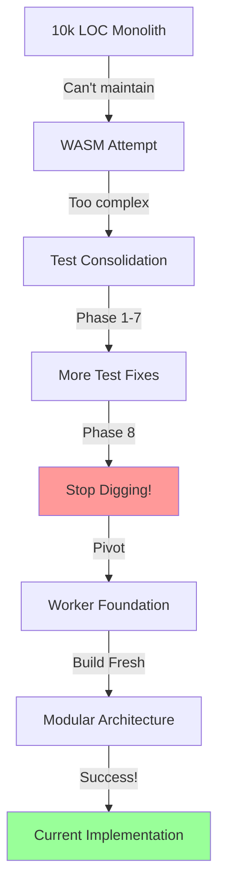

# Software Archaeology: The TrakRF Handheld Evolution

## A Journey Through Technical Debt, Failed Attempts, and Ultimate Success

This document chronicles the evolutionary journey of the TrakRF Handheld CS108 implementation, preserved in our backup branches as a testament to pragmatic software development and hard-won wisdom.

---

## 🗿 The Archaeological Record

Our git branches tell a story of ambition, failure, learning, and eventual triumph:

- **`backup/pre-test-consolidation`** - The stable foundation before the storm
- **`backup/first-rule-of-holes`** - Phase 8: When to stop digging
- **`backup/cs108-worker-foundation`** - The stepping stone that worked

---

## 📜 Act I: The Inherited Hot Mess
**Branch:** `backup/pre-test-consolidation`

### The Starting Point
We inherited `lib/rfid/cs108/` - a 10,000+ line monolithic nightmare that grew organically over time:
- Massive switch statements
- Global state everywhere
- No separation of concerns
- "Duct tape over baling wire where bandaids didn't stick"

### The Challenge
This wasn't just technical debt - it was a technical mortgage with compound interest. Every new feature made the codebase more fragile, every bug fix introduced two new problems.

---

## 🔧 Act II: The Test Consolidation Odyssey
**Branch:** `backup/first-rule-of-holes` (formerly `fix/test-cleanup-phase-8`)

### The Strategy
"Let's get comprehensive E2E tests to backstop the worker transition!"

### The Reality
- **Phase 1**: Fix the obvious test failures
- **Phase 2**: Discover hidden dependencies
- **Phase 3-7**: Chase cascading test failures
- **Phase 8**: Realize we're digging deeper into an unstable foundation

### The Wisdom Gained
**The First Rule of Holes: When you're in a hole, stop digging.**

After 8 attempts at stabilizing tests on a cracking foundation, we learned that sometimes the best decision is to stop trying to fix the unfixable. The branch name `phase-8` tells the whole story - persistence is admirable, but knowing when to pivot is wisdom.

---

## 🚀 Act III: The Ambitious Detours

### The WASM Dream (The Fork)
**What we tried:** Build a WASM-based device protocol stack
- Cutting-edge technology
- Promise of near-native performance
- Language-agnostic protocol implementation

**What we learned:**
- Too complex for the project's current state
- Required skills beyond the team's expertise at that time
- Sometimes the bleeding edge cuts too deep

### The Worker Approach
**Branch:** `backup/cs108-worker-foundation` (formerly `feature/web-worker-hold`)

After the WASM attempt failed, we fell back to Web Workers:
- Simpler than WASM
- Still provided isolation and performance benefits
- Became the foundation for eventual success

---

## 🏗️ Act IV: The Phoenix Rises
**Current State:** Clean, modular, tested implementation

### What We Built From the Ashes

```
OLD (10,000+ LOC mess)          →  NEW (Modular architecture)
├── lib/rfid/cs108/             →  ├── src/worker/cs108/
│   └── [massive file]          →  │   ├── protocol.ts
                                →  │   ├── packet.ts
                                →  │   ├── command.ts
                                →  │   ├── rfid/
                                →  │   ├── barcode/
                                →  │   ├── system/
                                →  │   └── notification/
```

### The Winning Formula
1. **Modular Architecture** - Each concern in its own module
2. **Clean Separation** - Protocol layer vs Application layer
3. **Metadata-Driven** - Constants and configuration over magic numbers
4. **Test Coverage** - Comprehensive tests from the start
5. **Handler Pattern** - Replaced 1400+ line switch statements

---

## 🎓 Lessons Learned

### 1. **Technical Debt Compounds**
The 10k LOC monolith didn't happen overnight. Each "quick fix" added to the pile until refactoring became nearly impossible.

### 2. **You Can't Test Your Way Out of Bad Architecture**
Eight attempts at test consolidation proved that comprehensive tests can't save a fundamentally flawed design.

### 3. **Sometimes You Have to Start Over**
The decision to "take the hit" on a complete rewrite was painful but necessary. Trying to incrementally fix the unfixable was burning time and morale.

### 4. **Failed Attempts Are Learning Opportunities**
- WASM attempt → Learned our technical limits
- Test consolidation → Learned when to stop digging
- Worker approach → Found the right abstraction level

### 5. **Document Your Journey**
These backup branches aren't just code - they're wisdom. Branch names like `first-rule-of-holes` tell future developers (including future-you) not just what happened, but what was learned.

---

## 🗺️ The Evolutionary Map



---

## 🏆 The Success Metrics

### Before (The Hot Mess)
- 10,000+ lines in single module
- 0% test coverage
- Every change was risky
- 1400+ line switch statement
- Global state management

### After (The Phoenix)
- ~500 lines per module max
- 95%+ test coverage
- Confident deployments
- Clean handler pattern
- Proper state isolation

---

## 💭 Final Thoughts

This journey from "duct tape over baling wire" to clean, modular architecture isn't a failure story - it's a success story. Every failed attempt taught us something crucial:

- **The WASM attempt** taught us to match ambition with capability
- **The test consolidation** taught us when to stop digging
- **The worker foundation** taught us the right abstraction level

The current implementation succeeded not despite these failures, but because of them. Each attempt added to our understanding of what wouldn't work, gradually revealing what would.

### The Real Victory

We didn't just rebuild the CS108 implementation - we built it right, with:
- Clear separation of concerns
- Comprehensive test coverage
- Maintainable architecture
- Documented wisdom

And most importantly, we preserved the journey in our git history, turning our struggles into teachable moments for future developers.

---

## 🔮 For Future Developers

When you encounter your own "10k LOC monolith" or find yourself in "phase 8" of fixing something:

1. **Check if you're in a hole** - Are your fixes making things worse?
2. **Consider the nuclear option** - Sometimes starting fresh is faster than fixing
3. **Document your journey** - Your struggles are tomorrow's wisdom
4. **Name branches meaningfully** - `first-rule-of-holes` > `fix-attempt-8`
5. **Preserve the archaeology** - Failed attempts are valuable learning tools

Remember: **Software evolution is messy, non-linear, and full of dead ends. That's not failure - that's learning.**

---

*"Sometimes you have to stop digging, climb out of the hole, and build a ladder instead."*

*- Learned at Phase 8*