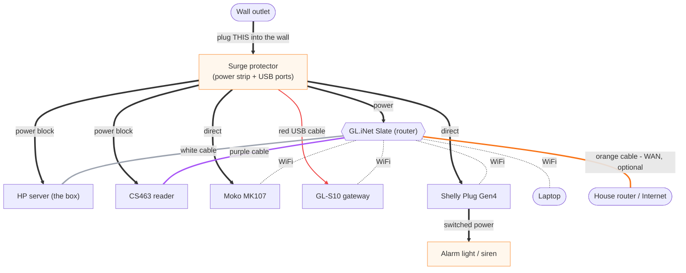

# TRA-904 — Frederick Health demo runbook (ENGINEER / Mike version)

> **Status: DRAFT for review (2026-06-18).** This is the **engineer** runbook —
> it assumes shell access (podman / systemctl / SQL / curl) and is for Mike, not
> Tim. **Tim's version is a separate file:** `tra-904-tim-demo-card.md` — app
> surface + physical connections only, no shell. Keep them in sync.
>
> Brought up to the current system after the post-seed fixed-reader work (PR #452,
> 2026-06-04). **Config/field details below were verified against the live demo
> box at `app.demo.trakrf.id` on 2026-06-18** (read-only walkthrough). Items that
> can only be settled with the rig in hand are tagged **[TUNE ON-SITE]**; open
> product decisions are tagged **[REVIEW]**.
>
> Epic: [TRA-897](https://linear.app/trakrf/issue/TRA-897) · this ticket:
> [TRA-904](https://linear.app/trakrf/issue/TRA-904). Edge box: [TRA-898](https://linear.app/trakrf/issue/TRA-898)
> (Done) · demo-tag/restart-safety: [TRA-966](https://linear.app/trakrf/issue/TRA-966) (last to land).

---

## What changed since the seed (orientation for reviewers)

The seed runbook predates these — they change the words Tim sees and where he clicks:

- **"Alarm Devices" → "Outputs"**, and the whole fixed-reader surface moved under
  **Settings** (TRA-929 rename, TRA-930 nav). Live nav order:
  **Settings → Readers · Live feed · Outputs · Geofence defaults**.
- **The demo fires the Shelly over MQTT, not HTTP.** The epic originally specced
  local HTTP, but the working box uses **`transport = MQTT (broker)`** to the
  on-box Mosquitto (TRA-906). HTTP is still selectable as an alternative (§ Appendix).
- **`is_boundary` is gone** (TRA-943). No "boundary scan_point" flag. The geofence
  resolves **location → outputs**, and each **output** carries a **mode**
  (`egress` | `presence`). The door output is **`egress`**.
- **RSSI / age-out / auto-off / mode are per-entity config**, not global env
  (TRA-955). Three tiers, most specific wins: **system default → org default
  (Settings → Geofence defaults) → per-output (Outputs expander)**.
- **Reader auto-provisions** (TRA-1002 / TRA-1015): the CS463 gets a working TrakRF
  profile on commission. We mostly *verify* rather than hand-build it.
- **EPC normalization** (TRA-944): a tag registered by its short barcode value still
  matches the full-width EPC the reader emits.
- Ingest matches a read to its capture point by **(reader, antenna_port)** (TRA-956).

---

## Known-good baseline (verified on the box, 2026-06-18)

The box is already provisioned and **actively reading** (org slug **`trakrf-demo`**,
build `v1.2.0-353-gb09ce98a`). Snapshot so any drift is obvious:

| Thing | Value |
|---|---|
| Reader | **CSL CS463 Fixed Reader** · `csl_cs463` · MQTT · topic `trakrf.id/cs463-20/reads` |
| Antennas | **Ant 1 enabled → location "Doorway 1 (DOORWAY-1)" @ 30.0 dBm**; Ant 2–4 disabled, unset |
| Reader read-timing | Dwell 500 ms · Dedup 0 ms · Antenna differentiation **on** · RSSI gate **−80 dBm (read-only)** |
| Power range | 10–31.5 dBm |
| Output | **Alarm Plug** · `shelly_gen4` · **MQTT** · topic `trakrf.id/alarm-plug` · switch `0` · location **Doorway 1** |
| Output tuning | **Mode = Egress** · **Auto-off = 3 s** · RSSI threshold blank (→ org/system default) · Age-out blank |
| Org geofence defaults | all blank → system default (mode = system default = egress) |
| Other readers present | Moko MK107 (`trakrf.id/mk107-23/reads`), GL-S10 (`trakrf.id/gls10-22/reads`) — BLE, not the egress demo |

**Wiring is correct and live:** CS463 Ant 1 → *Doorway 1* and Alarm Plug → *Doorway 1*
match, so a qualifying read at Ant 1 fires the strobe. For a **2–3 antenna** demo,
enable Ant 2/3 and set each to **Doorway 1** as well.

> **Grandfathered topics:** the reader/output use `trakrf.id/…`, not the
> `trakrf-demo/…` slug root the UI now wants for *new* devices (TRA-922). **Leave
> them — it's working.** Re-topic to `trakrf-demo/…` is a **post-demo** cleanup.

---

## Physical wiring (as shipped)

Shipped **pre-wired into the surge protector** — venue setup is "plug the surge
strip into the wall, optionally the orange cable into the house router." CS463 is
mains-powered via its power block (no PoE injector); GL-S10 is USB-powered off the
surge strip's charging port; the alarm light/siren is on the Shelly Plug's switched
outlet.



LAN cable colors: **white** = Slate↔box · **purple** = Slate↔CS463 · **orange** =
Slate WAN↔house internet (optional). MK107 / GL-S10 / Shelly reach the Slate over
WiFi. Thick arrows = power; dotted = WiFi.

---

## 0. The demo in one breath

A registered, tagged monitor carried through the doorway makes the CS463 read it
at the door antenna; the in-box backend sees the read qualify for an **armed** asset
at an **egress** output and fires the **Shelly Gen4 strobe** via the on-box MQTT
broker within ~1s. Unregistered tags do **not** fire. Auto-off (3 s) clears the
strobe between runs. The whole thing runs **offline** on the HP EliteDesk
(`trakrf-demo`); Tim drives from his laptop on the Slate WiFi.

```
CS463 (UHF) ──MQTT :1883──> Mosquitto ──> backend Go subscriber
                                │  ▲          │  raw → tag_scans → asset_scans
                                │  │          │  geofence eval (in-process)
                                │  └──────────┘  publish on/off to trakrf.id/alarm-plug
                                ▼
                       Shelly Gen4 (subscribes to broker) → strobe
              all on the box (192.168.8.10), no cloud, no DB round-trip, no inbound HTTP
```

Tim's laptop → **https://app.demo.trakrf.id** (resolved by the Slate to the box;
reachable off-site right now via the cloudflared tunnel during prep).

---

## 1. Demo data preload  **[REVIEW — no repeatable fixture yet; box is already seeded]**

> The box is **already provisioned by hand** (see baseline above) and backed up
> nightly (`pg_dump` → `/srv/trakrf/backups`). There is still **no repeatable seed
> fixture** — `deploy/edge/smoke-test.sh` only borrows `contract_test_seed.sql` to
> prove ingest. **Recommendation:** rely on the existing provisioning + backup for
> Friday; write a small idempotent `demo-seed.sql` as the immediate follow-up so a
> from-scratch wipe/rebuild is one command. Decide with Tim.

What has to exist for a fire (already true on the box; this is the rebuild order):

1. **Org** — `trakrf-demo` (single-tenant box). Slug is the topic root for *new*
   devices; existing devices grandfathered on `trakrf.id/…`.
2. **Location** — the doorway location (**"Doorway 1" / `DOORWAY-1`** on the box).
   The geofence ties an asset read to outputs **through the location**.
3. **Reader + antennas (Settings → Readers → expand the CS463).** Auto-provisions
   on commission (TRA-1002). It's a `multi_point` device → the expander shows the
   **Antennas & Location** panel, one row per port. For each of the **2–3 antennas**
   at the door:
   - **Enable** the antenna (toggle).
   - Set its **location** (click-to-edit on the row) to **Doorway 1**. ⇒ all door
     antennas share one location, so any fires the one output (§2).
   - Leave **transmit power** (dBm) at a sane start (30 dBm now); Tim tunes live (§9).
   - Disable unused ports (keeps Live feed clean).
4. **Assets + tags** — the monitors to arm. Register each asset, then add its **tag**
   (the EPC; short barcode value is fine, TRA-944). Armed EPCs = the membership set.
5. **Output (Settings → Outputs).** On the box: **Alarm Plug**, **Transport = MQTT
   (broker)**, **Command Topic = `trakrf.id/alarm-plug`**, **Switch ID = `0`**,
   **Location = Doorway 1**, **Mode = Egress**, **Auto-off = 3 s** (§3 for the
   device-side MQTT config).
6. **One "decoy" unregistered tag** for the negative case — an EPC not registered
   to any asset.

---

## 2. Geofence rule config (verified)

There is no separate "rule" object — the rule **is** the wiring plus the output's
mode/thresholds:

- **Who can fire:** assets with a registered tag (membership set). Everything else ignored.
- **Where:** the door **location** links reads to the door **output**. With 2–3
  antennas, **every door antenna's scan_point carries the same door location**
  (set per-antenna, §1.3). One output at that location ⇒ any antenna's qualifying
  read fires the one strobe.
- **When:** the output's **Mode = Egress** ("fire on crossing, then latch") fires
  immediately on a qualifying read.
- **How sensitive (confirmed field locations):**
  - **Transmit power** per antenna — `Settings → Readers → CS463 → antenna row → slider` (dBm). Tim's live knob.
  - **RSSI threshold / Age-out / Auto-off / Mode** per output — `Settings → Outputs → expand`.
  - **Org defaults** for the same four — `Settings → Geofence defaults`. Blank everywhere = system default.
  - Reader-side **RSSI gate (−80 dBm) is read-only** in the reader panel — don't confuse it with the output RSSI threshold.

---

## 3. Output (Shelly Gen4) provisioning — MQTT (the demo path)

The box fires over the **on-box MQTT broker**: the backend publishes `on`/`off` to
`<command_topic>/command/switch:<switch_id>` and the Shelly (subscribed to the same
broker) actuates. No inbound HTTP to the device. HTTP is an alternative (Appendix).

**App side (Settings → Outputs):** Transport **MQTT (broker)**, Command Topic
`trakrf.id/alarm-plug` (grandfathered — leave it), Switch ID `0`, Location
**Doorway 1**, Mode **Egress**, Auto-off **3 s**.

**Device side (Shelly MQTT config — on-LAN, web UI or `MQTT.SetConfig`):** point it
at the on-box broker, set the same **topic prefix** (`trakrf.id/alarm-plug`), enable
MQTT control. Gen4 note (TRA-941): the backend already sends the required `src`; no
operator action.

**Validate device-side independently** (no backend — confirms device + broker + topic):

```bash
# on the box; MQPW from /srv/trakrf/secrets/.env
mosquitto_pub -h 127.0.0.1 -p 1883 -u trakrf-mqtt -P "$MQPW" \
  -t 'trakrf.id/alarm-plug/command/switch:0' -m on    # -m off to clear
```

If the relay clicks, the backend's publish produces the identical message.

### Auto-off / latch
- **Auto-off = 3 s** on the box: the strobe self-clears after 3 s — good for a
  hands-off loop. **[TUNE ON-SITE]** adjust if 3 s reads too short/long in the room.
- For **latching** (stay on until reset), set Auto-off `0`/blank and use the
  **Reset (off)** button in the output expander between runs.

### Test-fire semantics (MQTT = publish-and-trust)
A green **Test-fire** means the **broker accepted** the publish, **not** that the
relay confirmed (MQTT is fire-and-forget). If the relay doesn't move, the device
isn't subscribed / wrong topic prefix / not powered — check the device, not the app.
(Contrast HTTP, where a 502 is a real reachability failure — Appendix.)

---

## 4. Cold-start checklist (edge box)

On a box whose DB volume is already initialized, **a power-on self-starts the whole
stack** (systemd linger + `Restart=always`). Normal path: power on, wait ~1–2 min,
verify green.

**Green = all five containers up + health 200 + a synthetic read ingests.**

```bash
# on the box (shell over the tailnet, or locally):
podman ps --format '{{.Names}} {{.Status}}'   # expect: timescaledb mosquitto backend traefik cloudflared, all Up
curl -fsS http://127.0.0.1:8080/health        # expect: 200
deploy/edge/smoke-test.sh                      # expect: "PASS: broker -> subscriber -> ingest proven"
```

Then from the laptop: browse **https://app.demo.trakrf.id**, log in, open
**Settings → Live feed**, confirm reads appear when a tag is near the antenna.

> First-time / fresh-box bring-up (secrets, db-init, TLS cert) is **not** Tim's job
> — that's `deploy/edge/README.md`. This runbook assumes a handed-over box.

---

## 5. Verify-green checklist (before each run)

- [ ] `podman ps` → 5 containers **Up** (not Restarting).
- [ ] `curl /health` → **200**.
- [ ] **Live feed** shows reads when an armed tag is held near the door antenna.
- [ ] **Test-fire** the Alarm Plug output once → strobe fires → it self-clears (3 s) or **Reset**.
- [ ] Strobe is **off** (no leftover latch).
- [ ] Armed tags are on the assets you'll carry; the **decoy** tag is on nothing.

---

## 6. Walk-through choreography  **[REVIEW with Tim — his script]**

1. **Normal state** — Live feed quiet, strobe off. *"Nothing tagged is leaving."*
2. **The catch** — carry the registered monitor through at walking pace. Strobe
   fires within ~1s. *"That monitor just walked out — caught."*
3. **Reset** — auto-off clears it (3 s); back to quiet.
4. **The negative** — carry the **decoy** (unregistered) tag through. **No alarm.**
   *"Random tagged goods don't cry wolf — only your tracked assets."*
5. **The hard case [TUNE ON-SITE]** — concealed carry (bag / against the body). The
   real catch-rate story. Tune §9 so this fires reliably; if marginal, set the honest
   80–90% expectation (per the epic: ROI is device-replacement cost, so 80–90% wins).

---

## 7. Manual reset between runs

- **Auto-off (3 s):** wait; nothing to do.
- **Latching:** **Settings → Outputs → Alarm Plug → Reset (off)** (or `mosquitto_pub … -m off`, §3).
- A "stuck" strobe is the latch, not a hang — reset clears it.

---

## 8. Recovery — "something looks wrong"

| Symptom | Likely cause | Fix |
|---|---|---|
| No reads in Live feed | reader down / not commissioned / wrong topic | power-cycle the CS463; check `Settings → Readers` lists it; wait ~1–2 min (GlassFish is slow) |
| Reads appear but **no fire** | tag not registered, location mismatch, RSSI/power too strict | confirm asset+tag exist; output **Egress** at the **same location** as the antenna; raise power / loosen output RSSI (§9) |
| Test-fire green but **strobe doesn't move** (MQTT) | Shelly not subscribed / wrong topic prefix / unpowered | check the device's broker connection + topic `trakrf.id/alarm-plug`; `mosquitto_pub` test (§3) |
| Fires for **everything** | power/RSSI too loose, or decoy is actually registered | lower power / tighten output RSSI; confirm decoy tag unregistered |
| Strobe won't turn off | latched | **Reset (off)** in the output expander |
| Whole UI unreachable | box forward wedged / service down | `podman ps`; rootlessport watchdog self-heals in ~30s; else `systemctl --user restart <svc>` |
| Box rebooted mid-demo | power blip | self-starts (~1–2 min); re-run §5 |

Break-glass shell is over the tailnet (`systemctl --user …`, `journalctl --user -u <svc>`,
`podman …`). The box is offline at the venue — to reach it remotely, give it uplink
first (tether the box / Slate WAN to a phone), tailscale in, fix, then **go back
offline before resuming** (no updates pulling mid-window).

---

## 9. Antenna placement + transmit-power tuning  **[TUNE ON-SITE — the real demo prep]**

**Transmit power (per antenna, reader panel) is the primary knob** Tim works live;
the output RSSI threshold is the engineer backstop you set once.

**Two knobs, don't confuse them:**
- **Transmit power** (`Settings → Readers → CS463 → antenna row → slider`, dBm,
  range 10–31.5) — how *far/strong* each antenna reads. Tim's knob.
- **Output RSSI threshold** (`Settings → Outputs → Alarm Plug`) — how strong a read
  must be to *count* as a fire. Engineer backstop. (Reader-side −80 dBm gate is read-only.)

Procedure:
1. Mount the 2–3 antennas at the doorway; aim **across** the threshold, not down the
   hallway. Confirm each is **enabled** and carries **Doorway 1** (§1.3).
2. Open **Settings → Live feed** (or the per-reader Live Reads inside the reader
   expander); watch **RSSI** as a body carries the monitor through — normal, then
   bag/body-concealed.
3. **Raise transmit power** until concealed carry reads reliably as it crosses;
   **lower it** if tags read from across the room / standing nearby. Balance across
   antennas for even doorway coverage.
4. If power alone can't separate "through" from "near," set the output **RSSI
   threshold** just below the weakest reliable concealed read and above ambient.
5. Set **Age-out** so a single pass = one fire (no chatter); **Auto-off** to a
   duration that reads well (3 s now).
6. Repeat until normal carry ~100% and concealed as high as placement allows.

Starting point (prior cs463-212 validation): RSSI gate near **−65 dBm** at close
range with **lower TX power** — **treat as a guess for this room**; geometry,
antenna count, and mount will move it. Box currently runs Ant 1 @ 30 dBm.

Record final values:
- Antenna placement (×N): _______
- TX power per antenna: A1 ____  A2 ____  A3 ____  dBm
- Output RSSI threshold: _______  age-out: _______  auto-off: _______

---

## Appendix — HTTP fire path (alternative; not the box's current config)

Selectable as **Transport = HTTP (local edge)** when the backend can reach the
Shelly directly over LAN HTTP:
- **Base URL** = the Shelly's LAN address (e.g. `http://192.168.8.66`), **Switch ID**,
  **Location**, **Mode**.
- **Test-fire** is a real round-trip: green = device responded; **502 = unreachable**
  (wrong network / IP / device down).

Cloud/firewalled MQTT (preview/prod, not the box): broker
`mqtt.{preview,prod}.gke.trakrf.id:8883`, TLS 1.2, shared `trakrf-mqtt` creds; the
Shelly must trust the Let's Encrypt CA chain (same gotcha as the GL-S10 readers);
topic prefix `{org_slug}/…`.

---

## ─────────  ENGINEER QUICK CARD (Mike — has shell)  ─────────

> Tim's laminated card is the separate `tra-904-tim-demo-card.md`. This one has shell.

**TrakRF egress demo — engineer card**     Box: `trakrf-demo` @ `192.168.8.10` (offline)
Laptop (Chrome, Secure DNS **off**) → **https://app.demo.trakrf.id**

**START**
1. Power on box → wait ~1–2 min.
2. `podman ps` → 5 containers **Up** · `curl -fsS http://127.0.0.1:8080/health` → 200
3. App → **Settings → Live feed**: reads show when an armed tag is at the door.
4. **Settings → Outputs → Alarm Plug → Test-fire** → strobe fires → self-clears (3 s).

**RUN**
- Carry **registered** monitor through door → **strobe fires <1s**.
- Auto-off clears it (3 s), or Outputs → Reset.
- Carry **decoy** (unregistered) tag → **no alarm** (this is the point).
- Concealed/bag carry → catch-rate story (honest 80–90% if marginal).

**IF WRONG**
- No reads → power-cycle CS463, wait ~2 min.
- Reads but no fire → tag registered? output **Egress** + same **location (Doorway 1)**? power/RSSI too tight?
- Test-fire green but no flash → Shelly not on broker / wrong topic → `mosquitto_pub … -t trakrf.id/alarm-plug/command/switch:0 -m on`.
- Fires for everything → power/RSSI too loose / decoy is registered.
- Strobe stuck on → it's the latch → **Reset (off)**.
- UI dead → wait 30s (self-heals); else `systemctl --user restart <svc>`.

**NEVER** push updates / go online during a demo window (box is offline by design).
