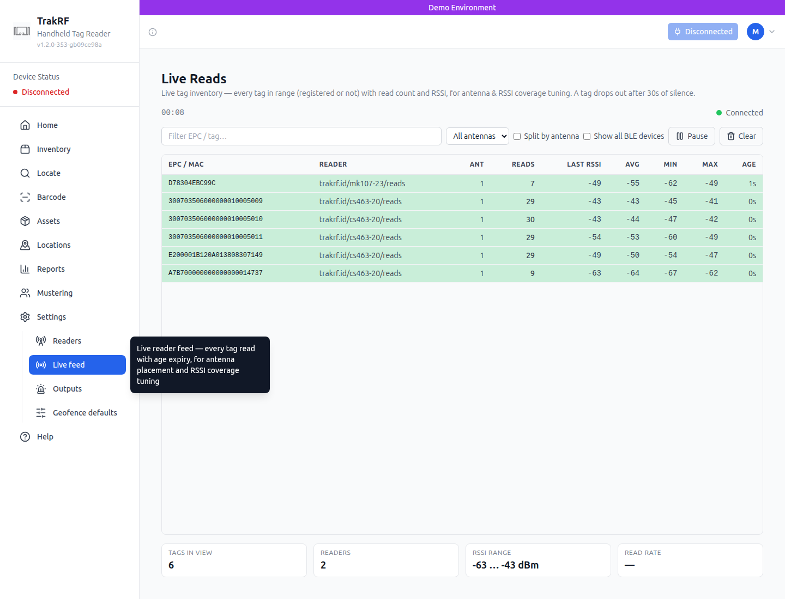
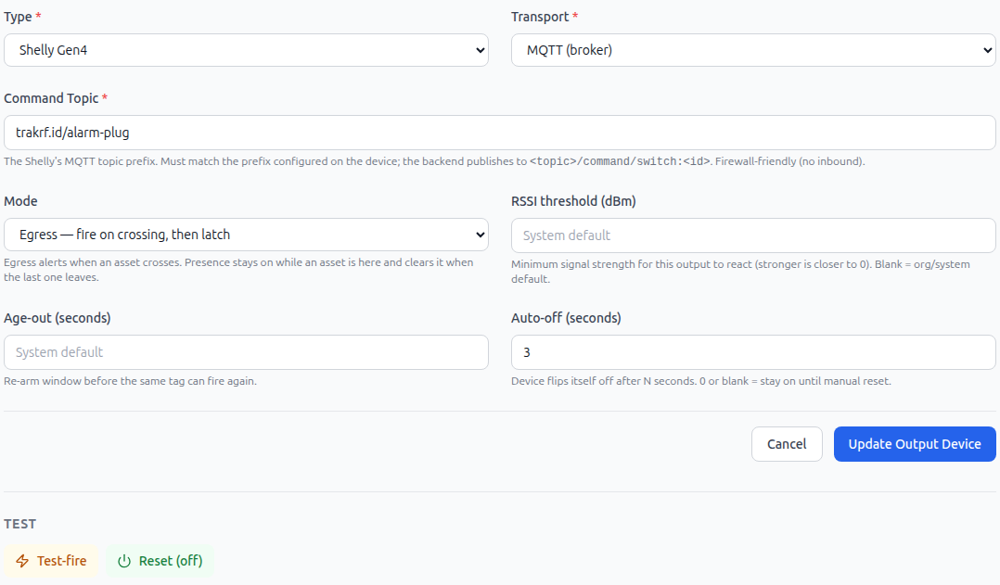
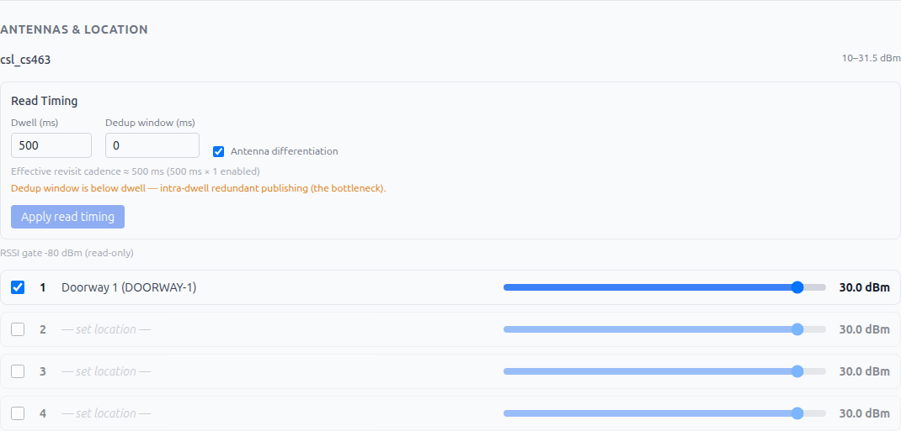

# TrakRF asset-egress demo — Tim's card

> **DRAFT for Mike + Tim review (2026-06-17).** This is the **operator** card —
> physical connections and the app only. No commands, no logins to the box.
> Anything not on this card = **call Mike**. Engineer detail lives in the
> companion `tra-904-demo-runbook.md`.

**The pitch in one line:** a tagged piece of equipment leaving through the door
sets off the strobe — and random tagged stuff walking by does *not*.

You only ever touch two things: the **physical gear** (plug it in, power it on)
and the **app in your browser** (`https://app.demo.trakrf.id`). That's it.

---

## A. Set up the gear (plug it in)  — ~5 min, do once per venue

Everything talks to each other over the little travel router; you don't configure
anything. Just give each piece power and let it boot.

1. **Router (GL.iNet "Slate"):** plug in power. Wait for its WiFi to come up.
2. **The box (small HP computer):** plug in power and the network cable to the
   router. Press the power button. Give it **~2 minutes** to start up.
3. **Reader (CS463) + antennas:** set your **2–3 antennas** at the doorway, each
   aimed *across* the opening (not down the hall). Connect each antenna cable to
   the reader, plug the reader into the router's network and into power. It's slow
   to boot — **~2 min**. (Mike has already told the app which antenna covers the
   door, so you just place and plug.)
4. **Strobe (Shelly):** plug it in near the door. That's the alarm.
5. Pour a coffee. Everything is booting. **Do not unplug anything mid-demo.**

> ✳️ If Mike pre-set the placement and taped marks on the floor, just match them.

---

## B. Turn it on / check it's alive  — every time, before an audience

1. On your **laptop**, connect WiFi to the **Slate** network.
2. Open **Chrome** and go to **`https://app.demo.trakrf.id`**. Log in.
   - *Page won't load?* Re-check laptop WiFi is on the Slate. Still nothing →
     give the box another minute, reload. Still nothing → **call Mike**.
3. In the app, open **Settings → Live feed**. Hold a **tagged** item near the
   doorway antenna — you should see reads pop up in the list. **Reads = the
   reader is alive.**

   

4. Open **Settings → Outputs**, expand the door strobe, click **Test-fire**.
   The strobe should flash; it clears itself after a few seconds (or click
   **Reset (off)**).

   

✅ **You're green when:** the page loads, Live feed shows reads, and Test-fire
flashes the strobe. If all three work, the demo will work.

---

## B2. Dial in the range (transmit power)  — your tuning knob

Each antenna at the door has a **transmit-power slider** in the app. More power =
reads tags from farther away; less power = only catches tags right at the door.

1. In the app, open **Settings → Readers**, click your reader to expand it. You'll
   see a row per antenna, each with a **power slider (dBm)**.
2. Keep **Settings → Live feed** open in another tab while you test-walk.
3. Walk the tagged item through — including **in a bag / against your body**:
   - Doesn't catch the concealed item? **Slide power up.**
   - Catches tags from across the room / when just standing near? **Slide power down.**
4. Aim for: walking *through* always fires, standing *near* doesn't. Sweet spot
   found → leave it. (No save button — it applies live.)

   

> This is the one setting you'll actively tune in the room. Everything else Mike
> pre-set. If you can't find a setting that works, **call Mike**.

---

## C. Run the demo

1. **Calm state** — strobe off, nothing happening. *"Nothing tracked is leaving."*
2. **The catch** — walk the **registered** item through the doorway at a normal
   pace. **Strobe flashes within ~1 second.** *"That just walked out — caught."*
3. **Reset** — clear the strobe (it may auto-clear; if not, **Outputs → Reset**).
4. **The point** — walk the **decoy** item (the one that's *not* registered)
   through. **Nothing happens.** *"Random tagged goods don't false-alarm — only
   your tracked assets do."*
5. **The real-world version** — carry the registered item in a **bag or against
   your body** and walk through. Catches most of the time. Honest line: *"~80–90%
   even concealed — and at replacement cost, catching most is the win."*
6. Reset and repeat as needed.

---

## D. If something looks wrong  (what YOU can do)

| You see… | Try this |
|---|---|
| Page won't load | Laptop on Slate WiFi? Reload. Wait 1 min. Still down → **call Mike**. |
| No reads in Live feed | Power-cycle the **reader** (unplug power, plug back, wait ~2 min). |
| Walking through doesn't fire | Reset the strobe and try again. Still nothing → **call Mike** (it's a settings tweak). |
| Strobe flashes for *everything* | **Call Mike** — needs a sensitivity tweak. |
| Strobe stuck ON | In the app: **Outputs → Reset**. |
| Strobe never flashes, even on Test-fire | Check the strobe is plugged in / powered. Still nothing → **call Mike**. |
| Box got unplugged / power blip | Plug it back in, power on, wait ~2 min, redo section **B**. |

**Golden rules**
- ✅ You handle: **plugging things in, powering on, clicking in the app.**
- 📞 Call Mike for: **anything that needs a setting changed, or that a power-cycle + wait doesn't fix.**
- 🚫 Never run software updates or connect the box to venue/hotel internet during a demo — it's meant to run on its own.
